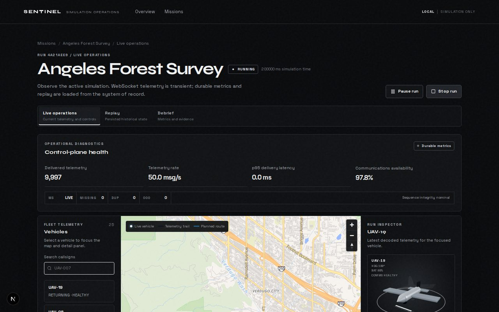
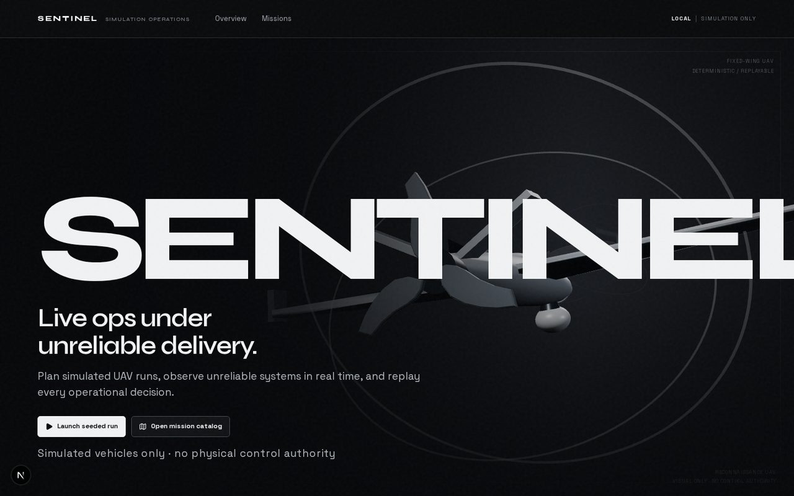
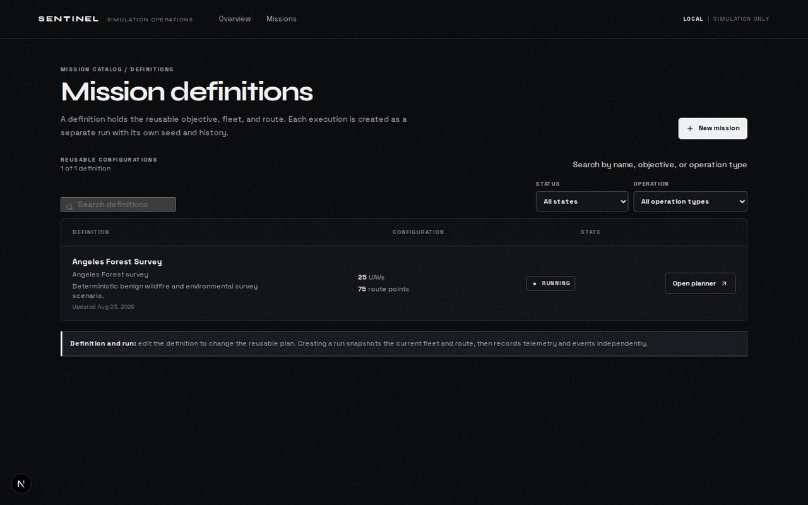
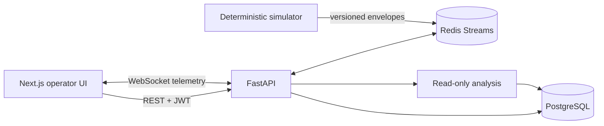

# Sentinel

[](https://github.com/SakoBagz/Sentinel/actions/workflows/ci.yml)
[](LICENSE)
[](apps/api)
[](apps/web)
[](apps/web)
[](docs/DATABASE.md)
[](docs/REALTIME.md)

**Realtime mission-operations platform for simulated UAV fleets** — plan missions, stream telemetry under unreliable delivery, inject faults, and replay durable evidence without re-running the simulator.

<p align="center">
  
</p>

| Landing | Mission catalog |
| --- | --- |
|  |  |

## Why this project

Most demos stop at a happy-path map. Sentinel focuses on the hard part of realtime systems:

- **Deterministic simulation** with seeded clocks and reproducible runs
- **Unreliable delivery** (loss, jitter, blackout) between vehicles and the control plane
- **Durable history** in PostgreSQL so replay and debrief never invent samples
- **Operator workflow** from mission definition → live ops → fault injection → replay → evidence-backed debrief

UAV flight is the scenario domain. The engineering substance is the telemetry pipeline, contracts, and operator surfaces.

## Tech stack

| Layer | Stack |
| --- | --- |
| Frontend | Next.js (App Router), React, TypeScript, Zustand, MapLibre GL, Three.js |
| API | FastAPI, Pydantic, SQLAlchemy async, Alembic |
| Data | PostgreSQL (system of record), Redis Streams (transient fan-out) |
| Simulation | Python deterministic engine (`simulator/`) |
| Auth (demo) | Signed JWTs with `operator` / `observer` roles + append-only audit log |
| CI | Pytest, Ruff, `tsc`, ESLint, Vitest, Playwright (Compose golden path) |

## Features

- **Mission planner** — fleet roster, map waypoints, pattern generation, readiness gates
- **Live operations** — WebSocket telemetry, MapLibre fleet map, integrity counters, fault injection
- **Replay** — seek persisted samples and events; no re-simulation
- **Debrief / analysis** — read-only summaries grounded in stored event evidence
- **Contracts** — versioned envelopes with event IDs and per-vehicle sequences
- **Benchmarks** — checked-in local scale results under [`benchmark-results/`](benchmark-results/)

## Architecture



The simulator does not block on database writes. REST owns configuration and history; WebSockets carry transient browser updates; replay reads only persisted samples and events.

## Repository layout

```text
apps/web/          Next.js operator UI
apps/api/          FastAPI modular monolith
simulator/         Seeded simulation engine + network impairment
docs/              Architecture, API, realtime, and product docs
infrastructure/    Render / Vercel deployment notes
benchmark-results/ Measured local in-process benchmarks
```

## Quick start

**Requirements:** Docker, Python 3.12+, Node.js 22.x, npm

```bash
nvm use
cp .env.example .env
npm install
docker compose up -d --build
```

- UI: [http://localhost:3000](http://localhost:3000)
- API health: [http://localhost:8000/api/health](http://localhost:8000/api/health)
- Same-origin proxy via the UI: [http://localhost:3000/api/health](http://localhost:3000/api/health)

Split processes (API/UI outside Compose):

```bash
docker compose up -d postgres redis
python3 -m pip install -r apps/api/requirements.txt
PYTHONPATH=apps/api:simulator uvicorn app.main:app --reload --app-dir apps/api
npm run dev:web
```

From the landing page, **Launch seeded run** starts the Angeles Forest Survey (25 UAVs with seeded fault scenarios) and opens live operations.

## Validation

```bash
make test
npm run typecheck
npm run lint
npm run build
npm --workspace apps/web run test:e2e
```

## Benchmarks (local, in-process)

Hardware and methodology are recorded under [`benchmark-results/`](benchmark-results/). Summary (3 simulated seconds, 10 Hz, seed 42):

| Vehicles | Messages | Throughput msg/s | Tick p95 ms | Errors |
| ---: | ---: | ---: | ---: | ---: |
| 100 | 3000 | ~27k | ~3.8 | 0 |
| 250 | 7500 | ~27k | ~9.5 | 0 |
| 500 | 15000 | ~27k | ~19 | 0 |
| 1000 | 30000 | ~27k | ~38 | 0 |

These measure the in-process simulator + sink, not Redis/Postgres/browser latency or cloud capacity. Re-run with `python3 scripts/benchmark.py`.

## Deployment

Reference layout: Next.js on **Vercel**, API + Postgres + Redis on **Render** (or equivalent).

See [infrastructure/vercel/README.md](infrastructure/vercel/README.md) and [docs/DEPLOYMENT.md](docs/DEPLOYMENT.md).

## Documentation

- [Walkthrough](docs/WALKTHROUGH.md) — demo path and design notes
- [Architecture](docs/ARCHITECTURE.md)
- [API contract](docs/API.md)
- [Realtime](docs/REALTIME.md)
- [Database](docs/DATABASE.md)
- [Web app guide](docs/WEB_APP_GUIDE.md)
- [ADRs](docs/DECISIONS.md)

## Scope

Supported scenarios: search and rescue, wildfire monitoring, environmental surveys, infrastructure inspection, mapping, and communications relay.

Sentinel is a **simulation** platform — not aerodynamics CFD, not a flight controller, and not a weapons or targeting system. Demo JWT auth illustrates role-based access and auditability; it is not a production identity provider.

## License

MIT — see [LICENSE](LICENSE).
