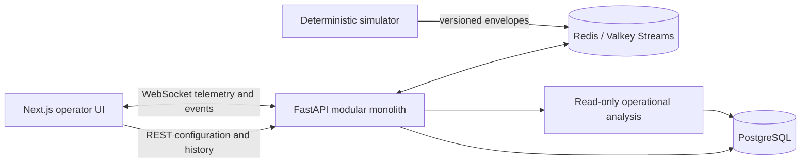

# Sentinel

[](https://github.com/SakoBagz/Sentinel/actions/workflows/ci.yml)

Sentinel is a real-time UAV mission-operations simulator built as a full-stack
systems project. It lets an operator define a benign mission, run a deterministic
simulation, observe live fleet telemetry, introduce controlled communications faults,
and inspect the persisted result through replay and operational analysis.

The project is intentionally focused on software systems behavior: stateful workflows,
event contracts, unreliable delivery, durable history, deterministic execution, and
clear operator feedback.

## Product flow

1. **Define** a mission, assign a fleet, and place route points on the map.
2. **Operate** the run through live WebSocket telemetry, diagnostics, and auditable
   simulated failures.
3. **Review** persisted metrics, event history, replay state, and evidence-backed
   analysis without rerunning the simulation.

The landing page also provides a seeded Angeles Forest run so the core workflow can be
explored immediately.

## Engineering highlights

- Next.js App Router interface with strict TypeScript and accessible stateful controls.
- FastAPI modular monolith with typed boundary validation and explicit domain services.
- PostgreSQL as the durable system of record.
- Redis/Valkey Streams for transient event fan-out and reconnectable WebSockets.
- Seeded simulator clock and random source for repeatable run traces.
- Versioned telemetry and event envelopes with event IDs and per-vehicle sequences.
- Idempotent durable processing with sequence-gap, duplicate, and ordering metrics.
- MapLibre live/replay views with planned routes, trails, and vehicle heading state.
- Bounded failure injection for communications, latency, packet delivery, GPS, battery,
  sensor, and service conditions.
- Read-only post-run analysis linked to persisted event evidence.

## Architecture



The simulator does not wait synchronously for database writes. REST owns configuration
and historical queries; WebSockets carry transient browser updates; replay reads only
from persisted telemetry and events.

## Repository map

```text
apps/api/       FastAPI application, domain services, migrations, and API tests
apps/web/       Next.js application, unit tests, and Playwright acceptance tests
simulator/      Deterministic mission engine and network/battery models
scripts/        Seed, cleanup, load-test, and benchmark utilities
docs/           Architecture, contracts, product behavior, and operating notes
infrastructure/ Deployment manifests for local and hosted environments
```

## Quick start

Requirements: Docker, Python 3.11+ (3.12 recommended), Node.js 22.x, and npm.

```bash
nvm use
cp .env.example .env
npm install
docker compose up -d --build
```

Open [http://localhost:3000](http://localhost:3000), then choose **Launch seeded run**
or open the mission catalog to build a mission from scratch. The API health endpoint
is available at [http://localhost:8000/api/health](http://localhost:8000/api/health).

For split local processes instead of the full Compose stack:

```bash
docker compose up -d postgres redis
python3 -m pip install -r apps/api/requirements.txt
PYTHONPATH=apps/api:simulator uvicorn app.main:app --reload --app-dir apps/api
```

In another terminal:

```bash
npm run dev:web
```

## Validation

The repository's CI workflow runs migrations, backend and simulator tests, Ruff static
checks, strict TypeScript, ESLint, Vitest, a production Next.js build, and the browser
golden path against the built Compose stack.

```bash
make test
npm run typecheck
npm run lint
npm run build
npm --workspace apps/web run test:e2e
```

The end-to-end command expects the Compose API and web services to be running. CI
installs its own browser runtime.

## Documentation

- [Project overview](docs/PROJECT_OVERVIEW.md) — product workflow and engineering proof points.
- [Architecture](docs/ARCHITECTURE.md) — module boundaries and data flow.
- [API contract](docs/API.md) — REST resources and error semantics.
- [Web application guide](docs/WEB_APP_GUIDE.md) — screen responsibilities and state rules.
- [Analysis service](docs/ANALYSIS.md) — read-only summaries and evidence links.
- [Replay model](docs/REPLAY.md) — persisted playback and historical fidelity.
- [Performance plan](docs/PERFORMANCE.md) — benchmark methodology and disclosure rules.

## Operational boundary

Sentinel supports simulated search and rescue, wildfire monitoring, environmental
surveys, infrastructure inspection, mapping, and communications relay. It does not
implement weapon control, targeting, strike planning, autonomous engagement, firing
solutions, or evasion capabilities.

## License

No open-source license has been selected yet. Until one is added, the repository is
available for viewing and evaluation but should not be redistributed as a third-party
package.
