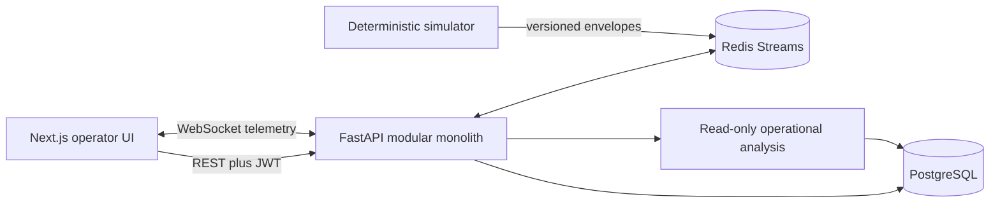

# Sentinel

[](https://github.com/SakoBagz/Sentinel/actions/workflows/ci.yml)
[](LICENSE)

**Deterministic mission-operations simulator for realtime systems engineering.**

Sentinel proves software behavior under unreliable delivery: an operator defines a
benign UAV mission, runs a seeded simulation, observes live fleet telemetry, injects
controlled communications faults, and inspects durable evidence through replay and
operational analysis—without rerunning the simulator.

UAV flight is the *scenario*. The engineering claim is the pipeline:
versioned telemetry contracts, Redis Streams fan-out, PostgreSQL durability,
deterministic replay, and auditable operator actions.

## Engineering map

| Capability | Where to look |
| --- | --- |
| Seeded deterministic ticks | [`simulator/sentinel_sim/engine.py`](simulator/sentinel_sim/engine.py) |
| Unreliable delivery (loss, jitter, blackout) | [`simulator/sentinel_sim/network.py`](simulator/sentinel_sim/network.py) |
| Backpressured durable persistence | [`apps/api/app/realtime/persistence.py`](apps/api/app/realtime/persistence.py) |
| Slow-client WebSocket shedding | [`apps/api/app/realtime/hub.py`](apps/api/app/realtime/hub.py) |
| Demo operator/observer auth + audit log | [`apps/api/app/auth/`](apps/api/app/auth/), `audit_events` |
| Live → replay → evidence debrief | `/runs/{id}/live` → `/replay` → `/debrief` |
| Measured local scale (not cloud capacity) | [`benchmark-results/`](benchmark-results/) |

## Product flow

1. **Define** a mission, assign a fleet, place routes (or generate SAR search patterns).
2. **Operate** through live WebSocket telemetry, integrity counters, and auditable faults.
3. **Review** persisted metrics, event history, replay, audit trail, and evidence-backed analysis.

The landing page **Launch seeded run** creates the Angeles Forest Survey (25 UAVs with
seeded blackout / battery / packet-loss incidents) and opens live operations.

## Engineering highlights

- Next.js App Router UI with strict TypeScript, MapLibre ops maps, and a telemetry-bound
  Three.js vehicle inspect panel (homepage craft is visual-only).
- FastAPI modular monolith with typed boundaries, demo JWT sessions, and RBAC-lite
  (`operator` mutate / `observer` read).
- PostgreSQL as the durable system of record; Redis Streams for transient fan-out.
- Seeded simulator clock/RNG; versioned envelopes with event IDs and per-vehicle sequences.
- Bounded failure injection (comms, latency, packet loss, GPS, battery, sensor, service).
- Append-only audit events for mission create, run lifecycle, faults, and analysis.
- CI: migrations, pytest (API + simulator), Ruff, `tsc`, ESLint, Vitest, Compose Playwright golden path.

## Architecture



The simulator does not wait synchronously for database writes. REST owns configuration
and history; WebSockets carry transient browser updates; replay reads only persisted
samples and events.

## Quick start

Requirements: Docker, Python 3.12 recommended, Node.js 22.x, npm.

```bash
nvm use
cp .env.example .env
npm install
docker compose up -d --build
```

Open [http://localhost:3000](http://localhost:3000). API health:
[http://localhost:8000/api/health](http://localhost:8000/api/health).

Split local processes:

```bash
docker compose up -d postgres redis
python3 -m pip install -r apps/api/requirements.txt
PYTHONPATH=apps/api:simulator uvicorn app.main:app --reload --app-dir apps/api
```

```bash
npm run dev:web
```

## Hosted demo

Deploy the UI on Vercel and the API on Render. Full steps:
[infrastructure/vercel/README.md](infrastructure/vercel/README.md).

Summary:

1. Deploy API + PostgreSQL + Redis on Render (`infrastructure/render/render.yaml`).
2. Import this repo on Vercel with **Root Directory** = `apps/web`.
3. Set `NEXT_PUBLIC_API_BASE_URL` and `NEXT_PUBLIC_WS_BASE_URL` to your API host.
4. Set Render `WEB_ORIGIN` to your Vercel URL and `AUTH_SECRET` to a long random value.

Demo auth uses signed session JWTs with role claims—it is not a production IdP. See
ADR-007 in [`docs/DECISIONS.md`](docs/DECISIONS.md).

## Measured benchmarks (local, in-process)

Hardware and methodology are recorded in each JSON file under
[`benchmark-results/`](benchmark-results/). Summary (3 simulated seconds, 10 Hz, seed 42):

| Vehicles | Generated | Throughput msg/s | Tick p95 ms | Errors |
| ---: | ---: | ---: | ---: | ---: |
| 100 | 3000 | ~27k | ~3.8 | 0 |
| 250 | 7500 | ~27k | ~9.5 | 0 |
| 500 | 15000 | ~27k | ~19 | 0 |
| 1000 | 30000 | ~27k | ~38 | 0 |

These measure the **in-process simulator + sink**, not Redis/Postgres/browser latency and
not cloud production capacity. Re-run with `python3 scripts/benchmark.py`.

## Validation

```bash
make test
npm run typecheck
npm run lint
npm run build
npm --workspace apps/web run test:e2e
```

## Documentation

- [Project walkthrough](docs/WALKTHROUGH.md) — demo flow, failure modes, technical notes
- [Project overview](docs/PROJECT_OVERVIEW.md)
- [Architecture](docs/ARCHITECTURE.md)
- [API contract](docs/API.md)
- [Performance](docs/PERFORMANCE.md) — goals vs measured results
- [Web application guide](docs/WEB_APP_GUIDE.md)
- [Decisions (ADRs)](docs/DECISIONS.md)

## Explicit non-claims

- Not aerodynamics CFD, not a flight controller, not a weapons or targeting system.
- Analysis defaults to a **mock** provider unless `ANALYSIS_PROVIDER` / API key is set.
- Hosted limits (when enabled) are intentionally lower than local benchmark profiles.
- Demo JWT auth demonstrates access-control literacy; it is not FedRAMP/IdP-ready security.

## Operational boundary

Supported scenarios: search and rescue, wildfire monitoring, environmental surveys,
infrastructure inspection, mapping, communications relay. Sentinel does not implement
weapon control, targeting, strike planning, autonomous engagement, firing solutions,
or evasion capabilities.

## License

MIT — see [LICENSE](LICENSE).
