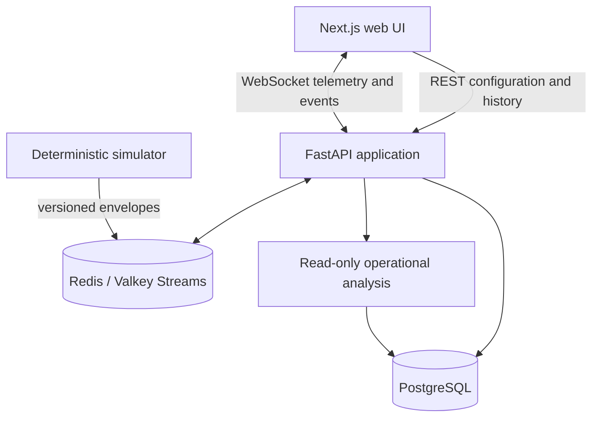

# Sentinel architecture

Sentinel is a modular monolith: one FastAPI application, one Next.js application, a
deterministic simulator, PostgreSQL for durable state, and Redis/Valkey Streams for
transient event distribution.



## Module boundaries

### Web application

The Next.js App Router owns route composition and presentation. Typed API clients
validate server responses at the browser boundary. Zustand owns the high-frequency
live telemetry store; replay state stays separate from live state. MapLibre is isolated
behind map components so the tile provider can change without changing domain logic.

### API and application services

FastAPI routes validate inputs, apply request-level limits, invoke an application
service, and serialize the response. They do not own mission transitions, navigation,
battery behavior, event persistence, or replay algorithms.

Application services coordinate the domain and infrastructure:

- `MissionService` — mission definitions, vehicles, waypoints, and profiles.
- `RunService` — immutable run snapshots and lifecycle commands.
- `TelemetryService` — envelope validation, sequencing, and persistence handoff.
- `EventService` — event taxonomy, severity, persistence, and historical queries.
- `ReplayService` — bounded time-window queries and replay shaping.
- `MetricsService` — throughput, latency, and integrity summaries.
- `AnalysisService` — read-only structured summaries and evidence references.

### Domain modules

The domain layer is framework-independent where practical:

- mission and run aggregates;
- vehicle lifecycle state machines;
- waypoint navigation and geospatial utilities;
- battery behavior;
- communications and network profiles;
- controlled failure injection;
- versioned telemetry and event contracts;
- seeded random source and simulation clock.

### Infrastructure adapters

Database repositories, Redis Streams, WebSocket broadcasting, structured logging,
metrics, and optional analysis providers live outside the domain. The simulator
publishes domain envelopes through an application port and never synchronously waits
for a PostgreSQL write on its hot path.

## Data flows

### Configuration

```text
Browser → REST API → application service → PostgreSQL
```

A run snapshots the mission definition, vehicle configuration, network profiles, and
random seed. Later edits to the reusable definition cannot change historical results.

### Simulation

```text
Simulator → versioned envelopes → Redis/Valkey Streams
                                      ├─ WebSocket broadcaster
                                      ├─ metrics processor
                                      └─ durable persistence worker → PostgreSQL
```

The simulation clock advances independently of network delivery. Consumers can retry
and deduplicate without blocking vehicle movement.

### Historical access

```text
Browser → REST API → PostgreSQL repositories → bounded response
```

Replay reads stored telemetry and events only. It never invokes the simulator or
reapplies random failures.

### Operational analysis

```text
Browser → analysis endpoint → read-only data access → structured response + evidence
```

Analysis is non-critical. Provider or quota failures affect analysis responses only;
mission planning, live operations, metrics, and replay remain usable.

## Reliability boundaries

- PostgreSQL remains authoritative if Redis/Valkey restarts.
- Redis Streams are transport and may lose transient in-flight state.
- Durable consumers use idempotent writes and can retry.
- WebSocket clients reconnect with bounded exponential backoff and restore topics.
- A backend cold start is presented as a recoverable service state in the UI.
- Public limits are enforced server-side rather than by the browser.

## Runtime profiles

| Concern | Local engineering | Hosted profile |
| --- | --- | --- |
| Frontend | Next.js local | Vercel or equivalent Node host |
| Backend | FastAPI local | Render or equivalent container host |
| Durable data | PostgreSQL | Managed PostgreSQL |
| Transient events | Redis/Valkey | Managed Redis/Valkey |
| Maps | MapLibre + OpenFreeMap | same |
| Scale | benchmark harness | bounded anonymous traffic |

Provider URLs and credentials are environment configuration. They do not leak into
domain logic.

## Invariants

1. Every run stores its seed and immutable configuration snapshot.
2. Every external event is versioned and validated at the boundary.
3. Every telemetry envelope has an event ID and per-vehicle monotonic sequence.
4. Durable telemetry writes are idempotent on `(run_id, vehicle_id, sequence)`.
5. Simulation state advances independently of communications delivery.
6. Replay uses persisted telemetry only.
7. Analysis has no mutation capability.
8. Hosted limits are enforced in the backend.
9. Per-run delivery and modeled-latency summaries are computed incrementally and
   persisted independently of telemetry downsampling.
